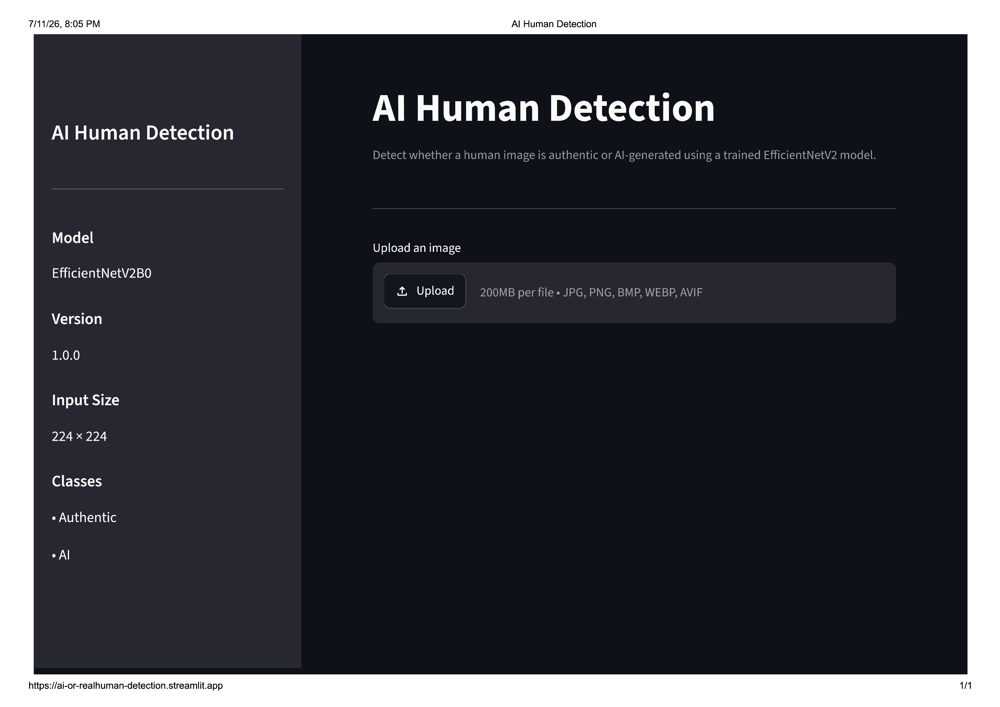
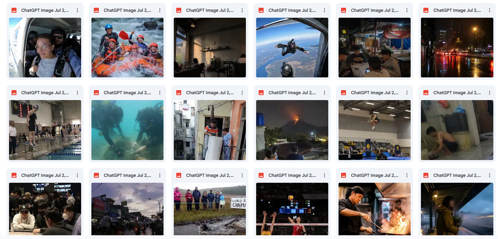

# AI Human Detection


> An end-to-end deep learning pipeline for distinguishing authentic human images from AI-generated human images using EfficientNetV2B0 and TensorFlow.

---

# Overview

AI-generated portraits are becoming increasingly realistic, making it difficult to distinguish synthetic images from authentic photographs.

This project implements a complete computer vision pipeline for binary image classification using transfer learning with EfficientNetV2B0. The project covers every stage of the workflow, from dataset cleaning to model deployment, following software engineering best practices including modular architecture, automated testing, code formatting, linting, Docker support, and CI.

---

## Live Demo

🔗 https://ai-or-realhuman-detection.streamlit.app/

## Demo




# Features

- End-to-end image classification pipeline
- EfficientNetV2B0 transfer learning
- Fine-tuning
- TensorFlow Dataset pipeline
- Automatic dataset cleaning
- Dataset preprocessing
- Training callbacks
- Performance evaluation
- Confusion matrix visualization
- ROC curve visualization
- Classification report generation
- Command-line inference
- Interactive Streamlit application
- Docker support
- Unit testing with Pytest
- Ruff linting
- Black code formatting
- GitHub Actions CI

---

# Project Architecture

```
AI_Human_Detection/

│
├── .github/
│   └── workflows/
│
├── .runtime/
│   └── python-version
│
├── docs/
│   └── images/
│
├── models/
│   ├── best_model.keras
│   └── final_model.keras
│
├── notebooks/
│   ├── 01_EDA.ipynb
│   ├── 02_Data_Cleaning.ipynb
│   ├── 03_Preprocessing.ipynb
│   ├── 04_Training.ipynb
│   └── 05_Evaluation.ipynb
│
├── reports/
│   ├── figures/
│   ├── logs/
│   └── metrics/
│
├── src/
│   ├── cleaning.py
│   ├── preprocessing.py
│   ├── model.py
│   ├── trainer.py
│   ├── predictor.py
│   ├── evaluator.py
│   ├── visualization.py
│   ├── config.py
│   ├── logger.py
│   └── utils.py
│
├── tests/
│
├── app.py
├── predict.py
├── Dockerfile
├── requirements.txt
├── README.md
└── runtime.txt
```

---

# Dataset

The dataset consists of two image classes.

| Class | Images |
|--------|-------:|
| Authentic Human | **515** |
| AI Generated Human | **537** |
| Total | **1052** |

Before training, every image passes through an automated cleaning pipeline including:

- Image validation
- Corrupted image detection
- RGB conversion
- JPEG conversion
- Sequential renaming
- Metadata logging
- MD5 checksum generation

## AI-Generated Image Collection

The AI-generated images in this dataset were created using ChatGPT. We also evaluated outputs from several other AI image-generation models, but based on our qualitative comparison, ChatGPT produced the most realistic, diverse, and suitable images for the objectives of this project.

The generated dataset was intentionally not limited to a single type of image, such as selfies, close-up portraits, or professional photography. It includes individual and group photographs, candid moments, action shots, indoor and outdoor scenes, different activities, lighting conditions, camera angles, compositions, aspect ratios, levels of image quality, and more.

This diversity was introduced to reduce reliance on narrow visual patterns and to better represent the range of human-centered images that may appear in real-world use.

Examples of some of the AI-generated images used in this project are shown below.



---

# Model

## Backbone

EfficientNetV2B0

## Training Strategy

- Transfer Learning
- Fine-Tuning

## Framework

TensorFlow 2.20

## Loss Function

SparseCategoricalCrossentropy

## Optimizer

Adam

---

# Pipeline

```
Raw Dataset
      │
      ▼
Dataset Cleaning
      │
      ▼
Preprocessing
      │
      ▼
Transfer Learning
      │
      ▼
Fine-Tuning
      │
      ▼
Evaluation
      │
      ▼
Inference
      │
      ▼
Deployment
```

---

# Model Performance

| Metric | Score |
|--------|-------:|
| Accuracy | **81.65%** |
| Precision | **82.09%** |
| Recall | **81.65%** |
| F1-Score | **81.60%** |
| ROC-AUC | **TODO** |

Per-class performance:

| Class | Precision | Recall | F1-Score | Support |
|--------|-------:|-------:|-------:|-------:|
| Authentic Human | 78.16% | 87.18% | 82.42% | 78 |
| AI Generated Human | 85.92% | 76.25% | 80.79% | 80 |

Generated reports include:

- Classification Report
- Confusion Matrix
- ROC Curve
- Training History

---

# Installation

Clone the repository.

```bash
git clone https://github.com/helggaa/ai-human-detection.git

cd ai-human-detection
```

Create a virtual environment.

Windows

```bash
python -m venv .venv

.venv\Scripts\activate
```

Linux/macOS

```bash
python -m venv .venv

source .venv/bin/activate
```

Install dependencies.

```bash
pip install -r requirements.txt
```

---

# Command-Line Inference

Predict a single image.

```bash
python predict.py path/to/image.jpg
```

Example output

```
Prediction

Authentic Human

Confidence

98.76%
```

---

# Streamlit Demo

Run the interactive web application.

```bash
streamlit run app.py
```

---

# Docker

Build the image.

```bash
docker build -t ai-human-detection .
```

Run the container.

```bash
docker run -p 8501:8501 ai-human-detection
```

Open http://localhost:8501

---

# Testing

Run all unit tests.

```bash
pytest
```

Current status

```
37 passed
```

---

# Code Quality

Lint

```bash
ruff check .
```

Formatter

```bash
black .
```

---

# Limitations

The model is trained exclusively on images containing humans, with the objective of distinguishing authentic human photographs from AI-generated human images.

It is not currently trained to recognize non-human or out-of-domain inputs. As a result, unrelated images—such as animals, objects, landscapes, illustrations, or other content without humans—will still be forced into one of the two available classes:

* Authentic Human
* AI Generated Human

Predictions on such inputs should therefore not be considered reliable. The current model assumes that every input image contains a human subject and falls within the scope of the training dataset.

---

# Future Work

* Add non-human and out-of-domain training samples
* Implement out-of-distribution input detection
* Add a distinct `Unsupported / Non-Human` rejection class
* Expand the dataset with more diverse human images
* ONNX export
* TensorRT optimization
* Explainable AI with Grad-CAM
* Model quantization
* REST API with FastAPI
* Multi-class classification

---

# License

This project is licensed under the MIT License.
